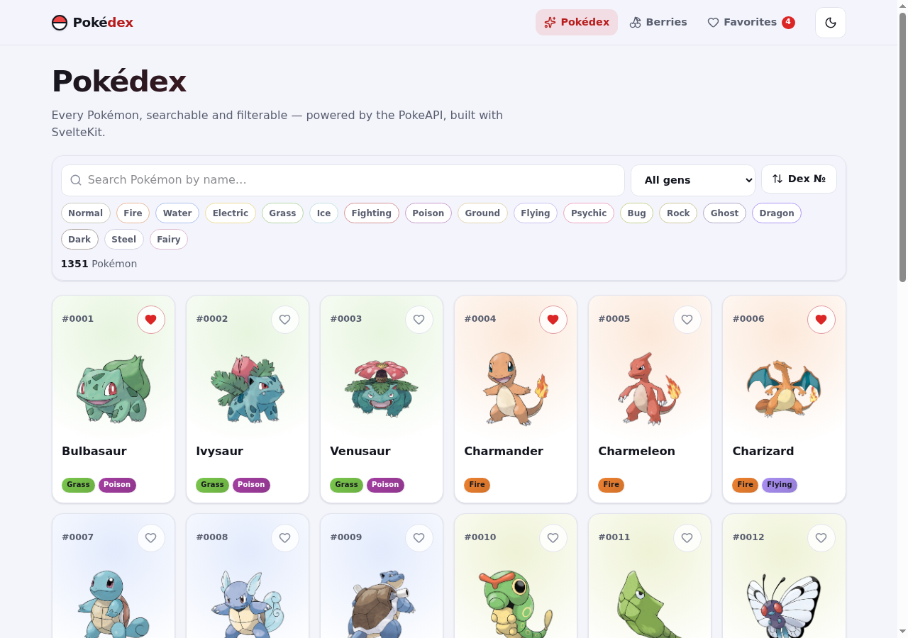
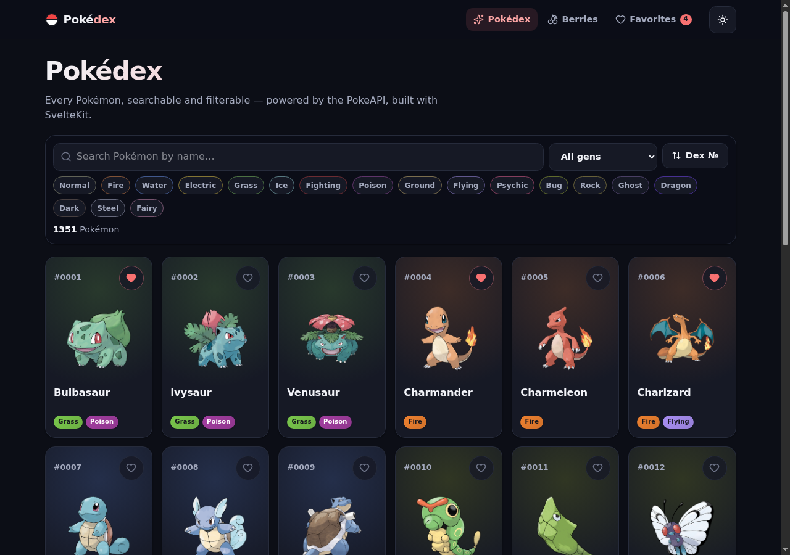
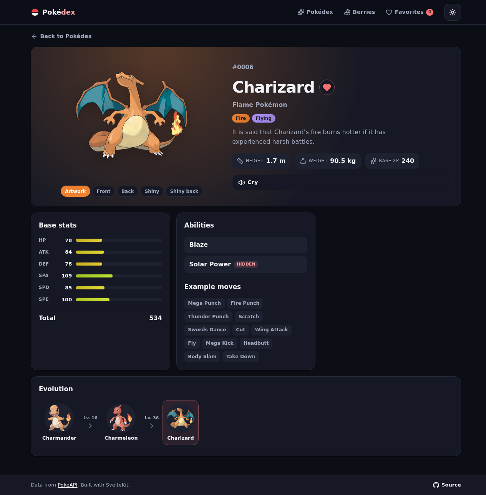
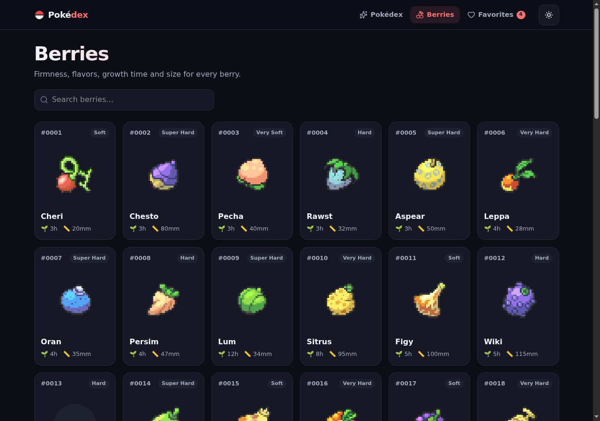

<div align="center">

# ⚡ Pokédex

### A polished, animated Pokédex for every Pokémon — built with SvelteKit 5 & the PokeAPI.

**[🔴 Live demo → azagatti.github.io/pokedex-tw-opus-off](https://azagatti.github.io/pokedex-tw-opus-off/)**

[](https://github.com/AZagatti/pokedex-tw-opus-off/actions/workflows/deploy.yml) [](https://azagatti.github.io/pokedex-tw-opus-off/) [](#-performance--quality)

[](https://svelte.dev/docs/kit) [](https://www.typescriptlang.org/) [](https://tailwindcss.com/) [](https://vite.dev/) [](https://zod.dev/) [](https://oxc.rs/)

</div>

---

<div align="center">
  
  
</div>

<div align="center">
  
  
</div>

## ✨ Features

- **🔍 Browse all 1300+ Pokémon** — responsive card grid with **infinite scroll** (IntersectionObserver, 30/page) and shimmer skeleton loaders.
- **⚡ Search, filter & sort** — debounced name search, **generation** (I–IX) filter, multi-select **type** filter (AND), and sort by dex № or base-stat total. Clear-filters control + empty states.
- **📄 Rich detail pages** — animated official artwork, type-colored gradients, **animated base-stat bars**, abilities (with hidden-ability tag), example moves, a full **evolution chain** with levels, a **sprite-variant switcher** (front / back / shiny), and a **play-cry** audio button.
- **🍒 Berries** — a full berries index and detail pages (firmness, flavor potencies, growth time, size, natural gift).
- **❤️ Favorites** — heart any Pokémon; favorites persist in `localStorage` and get their own page.
- **🌗 Dark / light theme** — flash-free (set before first paint), persisted, with a system-preference default.
- **♿ Accessible & tactile** — keyboard-navigable, labelled controls, WCAG-AA color contrast, 44px tap targets, and motion that respects `prefers-reduced-motion`.

## 🧰 Tech stack

| Area | Choice |
| --- | --- |
| Framework | **SvelteKit** (Svelte 5 runes) + **TypeScript** (strict) |
| Rendering | `@sveltejs/adapter-static` — SPA mode (`404.html` fallback), prerendered shell |
| Styling | **Tailwind CSS v4** (utilities) + hand-written CSS (motion, design tokens) |
| Icons | `@lucide/svelte` |
| Data | native `fetch` in a typed client + a small URL-keyed in-memory cache |
| Validation | **zod** — a schema per PokeAPI shape, parsed on every response |
| State | Svelte 5 runes + rune-based stores (theme & favorites → `localStorage`) |
| Tooling | **ultracite** → **oxlint** + **oxfmt**; **lefthook** git hooks |
| Testing | **vitest** (unit) + **Playwright** (e2e) |
| CI/CD | GitHub Actions → GitHub Pages |

## 🚀 Run locally

```bash
git clone https://github.com/AZagatti/pokedex-tw-opus-off.git
cd pokedex-tw-opus-off
npm install
npm run dev          # http://localhost:5173
```

Other scripts:

```bash
npm run build        # static build → ./build
npm run preview      # preview the production build
npm run lint         # oxlint
npm run format       # oxfmt
npm run check        # svelte-check (typecheck)
npm run test         # vitest unit + Playwright e2e
```

## 🏗️ Architecture

A static single-page app: the shell is prerendered, and everything renders client-side so dynamic routes work off GitHub Pages' `404.html` fallback. Data is fetched with native `fetch` inside a typed client, validated with zod, and memoized in a URL-keyed `Map` (with in-flight de-duplication so a 30-card page never fires the same request twice).

```
src/lib/
  api/         cache.ts · client.ts · schemas.ts      (fetch + zod + memo)
  stores/      theme.svelte.ts · favorites.svelte.ts  (runes + localStorage)
  components/  PokemonCard · TypeBadge · StatBar · EvolutionChain · …
  pokedex.ts · format.ts · constants.ts               (pure, unit-tested helpers)
src/routes/
  +page.svelte                 Pokédex list (search / filter / sort / ∞ scroll)
  pokemon/[name]/+page.svelte  detail (stats · abilities · evolution · cry)
  berries/ · favorites/        berries index+detail, favorites grid
```

See **[docs/ARCHITECTURE.md](docs/ARCHITECTURE.md)** for the data-flow, caching and routing details, and **[docs/DECISIONS.md](docs/DECISIONS.md)** for why each pinned choice was made.

## 📊 Performance & quality

Lighthouse (desktop, on the production build):

| Performance | Accessibility | Best Practices |   SEO   |
| :---------: | :-----------: | :------------: | :-----: |
|   **100**   |    **100**    |    **100**     | **100** |

FCP ~0.5s · LCP ~0.7s · TBT 0ms · CLS 0. CI runs lint → format-check → typecheck → unit → e2e → build on every push before deploying to Pages.

## 🙏 Credits

Data and sprites from the free [PokeAPI](https://pokeapi.co). Pokémon © Nintendo / Game Freak — this is a non-commercial fan project.
